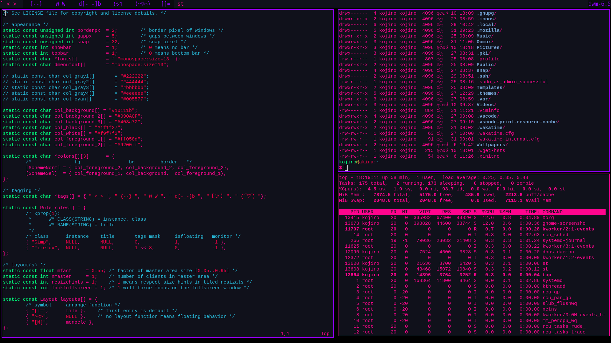

# Blossom Theme for Simple Terminal

## Preview


## Installation
1. Clone the repository.
```git clone https://github.com/BlossomTheme/ST.git```

2. Navigate to the repository.
```cd ./ST```

3. Install.
```sudo make install```

4. Enjoy!